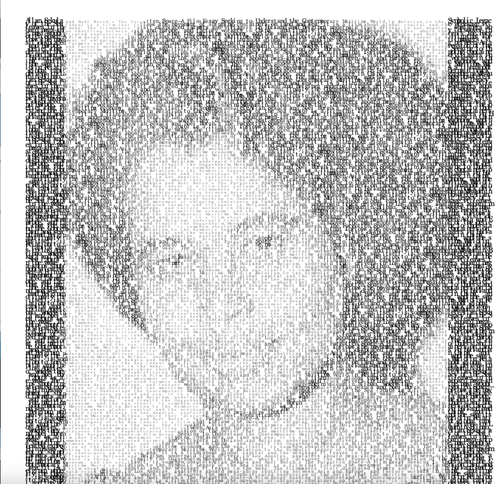

**Full Description:** We are delighted to propose a digital extension to the groundbreaking monograph, _In the Wake: On Blackness and Being_ (2016). Like a murmuration, we aim to transform text transcribed from _In the Wake_ into ASCII art. The community of symbols for the ASCII art is created from quoted text. This text-to-art will then be generated into GIF files. The GIPHY animations will be arranged as a sequence, such as a moving ship made up of XML marked-up text or quoted words, to produce a dynamic online pictographic essay.

**Bibliography:**
*   Berry, Anne H.; Collie, Kareem; Laker, Penina A.; Noel, Lesley-Ann; Rittner, Jennifer; Walters, Kelly. _The Black Experience in Design: Identity, Expression & Reflection._ Allworth Press: New York, NY. 2022.
*   Gilbert, Regine M. _Inclusive Design for a Digital World: Designing with Accessibility in Mind._ Apress: Berkeley, CA. 2019.
*   Sharpe, Christina. _In the Wake: On Blackness and Being._ Duke University Press: Durham, NC. 2016.

**Resources:**

*   [Extractivism, an example of an online graphic essay](https://extractivism.online/).
*   [An example of static ASCII art:](https://scipython.com/blog/ascii-art/).
*   [An example of animated ASCII art:](https://giphy.com/explore/ascii-art).
*   [An example of a pixellated video-essay:](https://vimeo.com/461887125).
*   Digital Tools: Processing (JS library) and Animating (Python coding allows more creative control than GIPHY generator)


**Caption:** Text quoted from the first paragraph of Chapter 2 of _In The Wake_ (2016) processed into a portrait of Sylvia Wynter.

**Work Plan:**

| Week        | Task          | Assignee | Status |
|:-------------|:------------------|:------|:------|
| Week 4         | - Contact Christina Sharpe<br/> - Define graphic identity<br/> - Begin Github page<br/> | - Ra & team<br/> - Nico & team<br/> - Massiel & team<br/> | Completed  |
| Week 5      | - Close reading of ch. 2 of monograph-generate list of 10 themes<br/> - Land on art software and text-art workflow<br/> - Individual Journals Due<br/>   | - Entire Team<br/> - Nico<br/>   | In progress  |
| Week 6           | - Visualizing themes:<br/> —- 1) generate an image associated with each theme<br/> —- 2) generate a dozen frames per image<br/>  - Group Report I Due (Massiel)<br/>    | Entire Team   | Not yet started  |
| Week 7           | - Animate images: Convert ASCII to Animation<br/> - Email Christina Sharpe & team with project proofs<br/> | Each member animates images according to their chosen themes  | Not yet started  |
| Week 8           | - Animate images: Convert ASCII to Animation<br/> - Group Report II Due (Ra) | Each member animates images according to their chosen themes  | Not yet started  |
| Week 9 | Read design texts   | Entire Team  | Not yet started  |
| Week 10           | - Plan website layout:<br/>  —- 1) text/commentary,<br/>  —- 2) media,<br/>  —- 3) sections<br/>  - Individual Journals Due   | Nico (lead) + team support   | Not yet started  |
| Week 11           | - Building sections (headers, tabs, etc.)<br/> - Group Report III Due (Nico)<br/> | Ra (lead) + team support  | Not yet started  |
| Week 12           | Upload text;  Individual Journals Due    | Ra & Massiel (leads) + Nico and Nina   | Not yet started  |
| Week 13           | Upload media; Group Report IV Due (Nina) | Ra & Massiel (leads) + Nico and Nina  | Not yet started  |
| Week 14           | - Cleaning up the arrangement<br/> - Testing website on different devices:<br/> —- 1) usability,<br/> —- 2) exports<br/> - Individual Journals Due<br/> | Nina (lead) & Massiel (support) | Not yet started  |
| Week 15 | Presentation practice   | Entire team  | TBD | 
| Week 16           | TBD     | Entire team   |TBD|

**Team Roles & Bios:**
*   Ra Bacchus:
      - Role: Back-end Website Developer; Content Contributor and Coder 
      - Bio: Ra Bacchus (he/him) is a second-year Ph.D. student in the Department of English. He is a UM Fellow for the 2024-25 academic year and a co-convener of the Queer Studies Interdisciplinary Reading Group. An active digital humanist, he has presented at multiple conferences in Florida, including the 2024 Crossroads Applied Humanities Conference at NSU and the 2024 Marxist Reading Group  Conference on “Marxism & the Digital Public” at UF. Ra’s projects with texts and technologies advocate for interdisciplinary, multimodal, and affective ways of knowing from the Black Atlantic.
*   Nina Lee:
      - Role: User Experience (UX) Editor; Content Contributor and Coder 
      - Bio: Nina Lee (she/her) is a PhD student studying Literary, Cultural, and Linguistic Students in the Department of Modern Languages and Literatures at the University of Miami. She received her M.A. in English and Comparative Literature in 2022 from the American University in Cairo in Egypt and her Bachelor’s in Spanish and French Studies at the University of North Florida in 2019. Her research focuses on archipelagic studies, diaspora, movement, corporeality, and connection, with special attention to salsa music and dance as an embodiment of these topics.
*   Massiel Medina:
      - Role: Project Manager; Content Contributor and Coder 
      - Bio: Massiel Medina is a PhD student studying Literary, Cultural, and Linguistic Studies in the Department of Modern Languages and Literatures at the University of Miami. She holds Bachelor of Arts degrees in Psychology and Spanish and a Master of Arts degree in Foreign Languages and Literature from North Carolina State University. Her research interests include Caribbean literature and history, with particular attention to the Hispanic Caribbean as a transnational space through forms of mapping.
*   Nico Gerardi Rousset:
      - Role: Graphic Guide/Editor; Content Contributor and Coder 
      - Bio: Nicolás Gerardi is a multimedia writer and researcher. He holds an MFA in Creative Writing in Spanish from the University of Iowa. He has worked as an art department coordinator at the British Council Caracas and as a storyteller for various advertising agencies in Mexico. In 2022, he was an artist-in-residence at La Ceiba Gráfica in Veracruz, Mexico, where he participated in an intensive letterpress program. In 2023, he received the Ruth Davis Summer Fellowship to support his ongoing book art project, Prácticas Migratorias. His digital poetry book, Las Hifas de Anacaona, was selected for the virtual exhibition of the II International Visual Poetry Conference at the Federal Fluminense University. Currently based in Miami, he publishes books under @koontiepress and explores the intersection of bookmaking, poetry, and media art while pursuing a Ph.D. in English at the University of Miami. His research focuses on digital poetry in both the insular and continental Caribbean.


### Appendix: definition list of the wake

<dl>
<dt>Wake</dt>
<dd>The trail left by a watercraft</dd>
<dt>Wake</dt>
<dd>A burial rite</dd>
<dt>Wake</dt>
<dd>Cultural production informed by critical race theory</dd>
<dt>Wake</dt>
<dd>State of awareness or consciousness</dd>
</dl>

```
Back-end questions: bacchusjr@miami.edu
```
